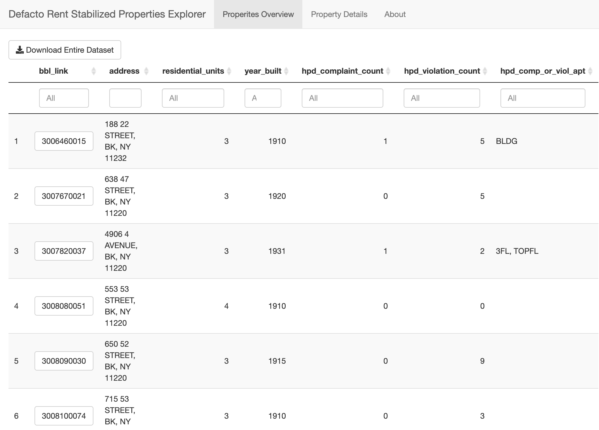

# De Facto Rent Stabilized Properties Explorer

In New York City, apartments in buildings containing six or more units built between February 1, 1947 and January 1, 1974 are subject to [rent stabilization](https://hcr.ny.gov/system/files/documents/2019/09/FACT%20SHEET%2001_0.pdf). Buildings built before 1974 that are officially recognized as having only 1-5 units but, due to illegal conversions, in fact have six or more units can be found to be [de facto rent stabilized](https://www.law.com/newyorklawjournal/almID/1202797874459/2042a-Pacific-LLC-v-Kelley/).

This app was built for [Mobilization for Justice](http://mobilizationforjustice.org/) to help legal advocates and organizers identify properties in Brooklyn that could potentially be "de facto rent stabilized", and provide useful information about the properties from public data them to explore and download. 

The app is built on top of the critical work done by [@aepyornis](https://github.com/aepyornis), and other members of the [Housing Data Coalition](https://www.housingdatanyc.org/), on the [NYCDB](https://github.com/nycdb/nycdb) project. NYCDB is an open-source Python library used to cleanly extract, sanitize, and load various NYC housing datasets into a PostgreSQL instance.

<a href="https://maxwell-austensen.shinyapps.io/defacto/">
	<p float="left">
		
		 
	</p>
</a>

## Setup

This app is built using R's [Shiny](https://shiny.rstudio.com/) package and uses a PostgreSQL database created by [NYCDB](https://github.com/nycdb/nycdb). 

### Database

To run this app locally you'll first need to install [NYCDB](https://github.com/nycdb/nycdb), create a PostgreSQL database, and populate the database with the required tables using NYCDB. Only the following NYCDB datasets are required: `pluto_19v1`, `pad`, `hpd_complaints`, `hpd_violations`, `ecb_violations`, `dob_violations`, `dob_complaints`, `oath_hearings`, `hpd_vacateorders`. 

Once all those datasets are added to the database, you can run the following to create the derived table that powers the app:

```
psql -h hostname -U user -d nycdb -f sql/defacto_bk_bbl_details.sql
```

### App 

You will also need to edit the file [`config_sample.yaml`](config_sample.yaml) to fill in these credentials for your local NYC-DB instance, then rename the file to `config.yaml`. 

From this point on there are two options for getting the app running locally:

#### Docker Option

To allow your local NYC-DB database to be reached from the app inside the docker container you'll need to edit the PostgreSQL configuration file `postgresql.conf` to change the line `listen_addresses='localhost'` to `listen_addresses='*'`. You can locate this file with the following command:

```
psql -U postgres -c 'SHOW config_file'
```

Finally, you can [install Docker](https://www.docker.com/get-started) and run the following commands from the top level of this repo.

```
docker-compose build
docker-compose up
```

Now to view the app you can visit http://localhost:80/ in your browser.  

**Logs**

When developing the app locally using Docker to get access to the log files generated by Shiny you can run `docker exec -it shiny bash` and then `ls /var/log/shiny-server` to see the available logs. To copy these logs to the host system for inspection, while the container is running, you can use, for example, `docker cp shiny:/var/log/shiny-server ./logs_for_inspection`.

#### Non-Docker Option

First, you need to download and install [R](https://cloud.r-project.org/).

Then, from the top level of this repo, run the following command to install the required R packages and launch the app.  

```
RScript run-app.R
```

Now to view the app you can visit http://localhost:80/ in your browser.
